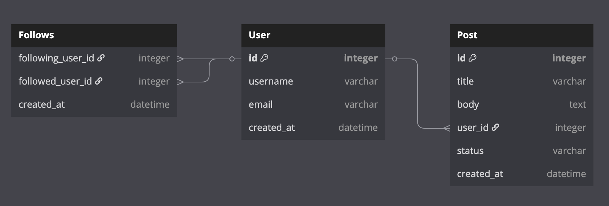
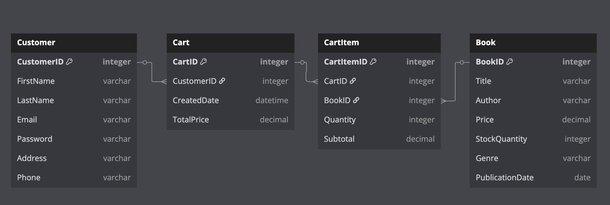

# Assignment

## Brief

Create an ERD for each of the following case study question.

## Instructions

Paste the answer as DBML in the answer code section below each question.

### Question 1

Construct an ERD for a social media company whose database includes information about users, their followers, and the posts that they make. Users can follow multiple users and create multiple posts.

Each entity has the following attributes:

- User: id, username, email, created_at
- Post: id, title, body, user_id, status, created_at
- Follows: following_user_id, followed_user_id, created_at

Answer:

```dbml
// Entities
Table User {
  id integer [primary key]
  username varchar [unique]
  email varchar [unique]
  created_at datetime
}

Table Post {
  id integer [primary key]
  title varchar
  body text
  user_id integer
  status varchar
  created_at datetime
}

Table Follows {
  following_user_id integer
  followed_user_id integer 
  created_at datetime
}

// Relationships
Ref: Post.user_id > User.id               // One-to-Many: One User has many Posts
Ref: Follows.following_user_id > User.id  // Many-to-Many: User follows Users
Ref: Follows.followed_user_id > User.id   // Many-to-Many: User is followed by Users
```

### Question 2

Construct an ERD for a company that sells books online. The company has a website where customers can browse available books and add them to their shopping carts. Each cart can contain multiple books.

There are 4 entities, think of what attributes each entity should have.

- Customer
- Book
- Cart
- CartItem

Answer:

```dbml
// Entities
Table Customer {
  CustomerID integer [primary key]
  FirstName varchar
  LastName varchar
  Email varchar [unique]
  Password varchar
  Address varchar
  Phone varchar
}

Table Book {
  BookID integer [primary key]
  Title varchar
  Author varchar
  Price decimal
  StockQuantity integer
  Genre varchar
  PublicationDate date
}

Table Cart {
  CartID integer [primary key]
  CustomerID integer 
  CreatedDate datetime
  TotalPrice decimal
}

Table CartItem {
  CartItemID integer [primary key]
  CartID integer
  BookID integer 
  Quantity integer
  Subtotal decimal
}

// Relationships
Ref: Cart.CustomerID > Customer.CustomerID // One-to-One: One Customer has one Cart
Ref: CartItem.CartID > Cart.CartID         // One-to-Many: One Cart has many CartItems
Ref: CartItem.BookID > Book.BookID         // One-to-Many: One Book can be in many CartItems
```

## Submission

- Submit the URL of the GitHub Repository that contains your work to NTU black board.
- Should you reference the work of your classmate(s) or online resources, give them credit by adding either the name of your classmate or URL.
